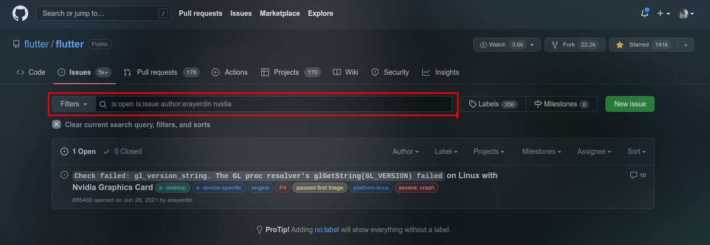
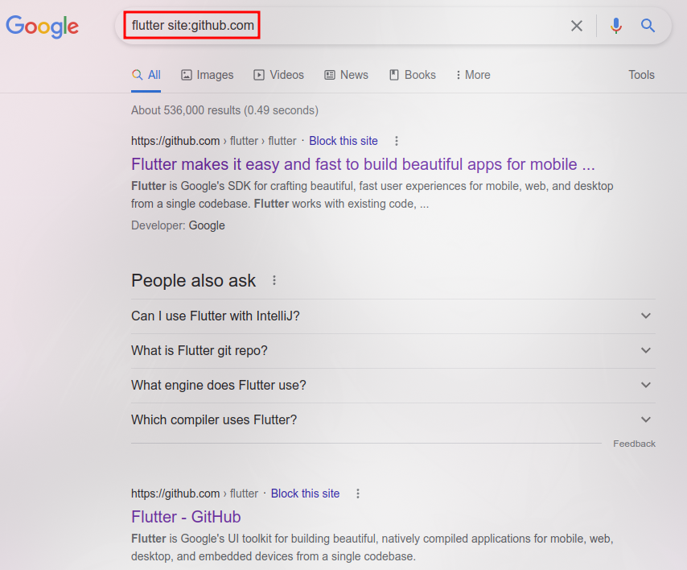

<!--
 oldl (c) by Eray Erdin
 
 oldl is licensed under a
 Creative Commons Attribution-ShareAlike 4.0 International License.
 
 You should have received a copy of the license along with this
 work. If not, see <http://creativecommons.org/licenses/by-sa/4.0/>.
-->

# OLDL

OLDL (One-Line Data Language) is a data language just like JSON, YAML and TOML. However, hence the name, the data is represented on only one line.

## Why?

In modern software, filtering and sorting feature is provided by custom widgets like chips, dropdowns or checkboxes etc.

<figure markdown>

<figcaption>Filtering by chips in Material design</figcaption>
</figure>

<figure markdown>

<figcaption>Filtering by checkboxes in Material design</figcaption>
</figure>

While using components to filter or sort the data is a good approach especially in terms of UI/UX, these components are moderately hard to implement, prone to bugs at times and they are hard to expand when new requirements for a software arrive.

There's another and much simpler approach to filter or sort the data. This is how Github handles it.

<figure markdown>

<figcaption>The issues are filtered by tickets that are open, is type of issue, started by user `erayerdin` and contains keyword `nvidia`.</figcaption>
</figure>

Google also uses some a similar approach in its search engine.

<figure markdown>

<figcaption>The search is filtered to only get the pages on `github.com` domain while the keyword is `flutter`.</figcaption>
</figure>

This is a much simpler approach. The only problem is that this is not standardized. Any other app might have somehow similar way but it might also differ. [Stackoverflow](https://stackoverflow.com/help/searching), for example, differs at some points.

This method of providing metadata is easier to provide, implement, expand and comprehend. OLDL tries to set a standard on this approach.

## Objectives

 - **The data should be human-readable**. A person should recognize and congnitively-parse what the data represents easily.
 - **The data should be *human-writable***. As well as human-readability, the standard should be set in a way that a user can provide this data. In desktop, (i) it should require as less key combinations[^1] as possible and (ii) these key combinations should be physically close[^2] to each other. In mobile, it should have (i) as less long-press[^3] as possible and (ii) page-switch on virtual keyboard[^4] should be avoided.
 - **Users should be able to provide content along with data**. In some cases, key-value pairs do not make sense by themselves or they are simply not enough. So, users should be able to provide a content containing keywords to narrow the results down further.
 - **The data should be friendly for any user**. OLDL does not only target developers as users, but everyday users as well. The data should be presented in a way that any user make sense out of it or write it.
 - **The data should be flat as much as possible**. Since the data should be *human-writable* and *human-readable*, a second dimension in data would require complex representations, which is very hard to read and write. That's why it's better to keep it in one dimension as much as possible.

## Documentation License

This document is licensed under [CC BY-SA 4.0](https://creativecommons.org/licenses/by-sa/4.0/).

[^1]: It is meant that the case where user needs to press multiple keys at once to provide a character, usually these combinations start with `SHIFT`, `CTRL`, `ALT` etc.

[^2]: In order to provide colon sign (`:`), user should press `SHIFT+.`, which is physically very close to each other.

[^3]: It is meant that user needs to press and hold a key in mobile virtual keyboards. It slows down data providing process and might get user annoyed.

[^4]: It is meant that user needs to switch the page on the mobile keyboard to find a specific character. It is annoying to switch the page and try to find a character, so it should be avoided if possible.
